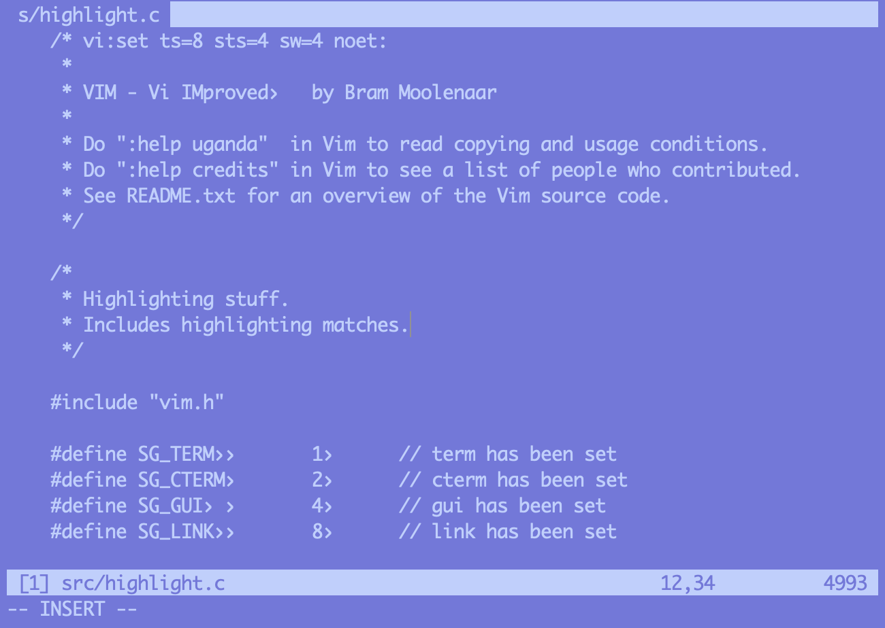

normalise.vim
=============

A truly monochrome scheme that uses only your terminal’s foreground and
background colours.




Using
-----

The default colours are derived from your terminal’s style. If you
would like to override this you can set the `Normal` highlight group to
something custom. For example:

```vim
augroup NormaliseColors
	au!
	au ColorScheme * hi Normal ctermfg=231 ctermbg=99
augroup END
```


See Also
--------

  - [casr/vim-colors-reference](https://github.com/casr/vim-colors-reference)
  - [casr/vim-colors-chromatine](https://github.com/casr/vim-colors-chromatine)


Licence
-------

Public domain
